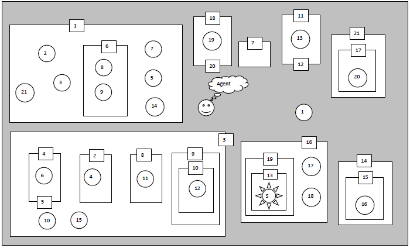

# Prolog exercise
Project for Artificial Intelligence lecture BTI7510 at BFH in 2021

## Puzzle
The goal of this project was to solve following puzzle



Where it is the agents goal to find the treasure by moving from room to room through the doors.
To open the door N the corresponding key N is required. Keys can be picked up when the agent is in the same room as the key.

## Method
A prolog program was implemented in three parts:

`db.pl` contains a representation of the puzzle, where `treasure(ROOM)` denotes in which ROOM the treasure is located, `door(ROOMX, ROOMY, KEYY)` describes that there is a door from ROOMX to ROOMY that can be opened with KEYY and `key(ROOM, KEY)` indicates that KEY can be found in ROOM.

`solve.pl` contains the logic to solve the puzzle. At every time there are three possible types of steps or actions that the agent can take:
- Finding the treasure
- Switching rooms
- Picking up a key

Thus there are three definition of `step()`.

While solving, we keep track of which room the agent is in, which keys have been picked up, which rooms have been visited (to avoid loops) and a log of the previous steps.

`run.pl` allows for easy execution of the solver and can be for example run like this `swipl -s run.pl`

### Attribution
Some inspiration was taken from following [publicly available project on Github](https://github.com/MLauper/Prolog_Doors-and-Keys).

## Solution
Our programs outputs a valid solution:
```
Pick up key1 in room0
Switch from room0 to room1
Pick up key2 in room1
Pick up key3 in room1
Switch from room1 to room0
Switch from room0 to room3
Switch from room3 to room2
Pick up key4 in room2
Switch from room2 to room3
Switch from room3 to room45
Pick up key6 in room45
Switch from room45 to room3
Switch from room3 to room0
Switch from room0 to room1
Switch from room1 to room6
Pick up key8 in room6
Switch from room6 to room1
Switch from room1 to room0
Switch from room0 to room3
Switch from room3 to room8
Pick up key11 in room8
Switch from room8 to room3
Switch from room3 to room0
Switch from room0 to room1
Switch from room1 to room6
Pick up key9 in room6
Switch from room6 to room1
Switch from room1 to room0
Switch from room0 to room1112
Pick up key13 in room1112
Switch from room1112 to room0
Switch from room0 to room1
Pick up key21 in room1
Switch from room1 to room0
Switch from room0 to room3
Pick up key10 in room3
Switch from room3 to room10
Pick up key12 in room10
Switch from room10 to room3
Switch from room3 to room0
Switch from room0 to room1
Pick up key7 in room1
Switch from room1 to room0
Switch from room0 to room3
Pick up key15 in room3
Switch from room3 to room0
Switch from room0 to room1
Pick up key5 in room1
Pick up key14 in room1
Switch from room1 to room0
Switch from room0 to room14
Switch from room14 to room15
Pick up key16 in room15
Switch from room15 to room14
Switch from room14 to room0
Switch from room0 to room16
Pick up key17 in room16
Switch from room16 to room0
Switch from room0 to room21
Switch from room21 to room17
Pick up key20 in room17
Switch from room17 to room21
Switch from room21 to room0
Switch from room0 to room1820
Pick up key19 in room1820
Switch from room1820 to room0
Switch from room0 to room16
Switch from room16 to room19
Switch from room19 to room13
Treasure found in room13
```
Hurra!
